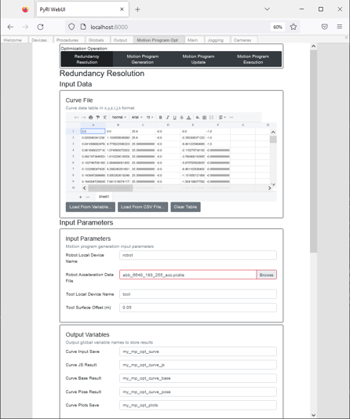
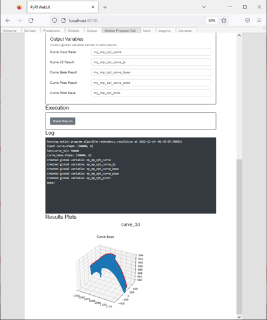

# Motion Program Optimization User Interface

The motion program optimization user interface provides a frontend to the motion program algorithms. The 
`pyri-robotics-motion-program-browser` package adds the `Motion Opt` tab to the user interface. 

Inside the tab, there are four pages selected by the buttons on the top of the page:

* Redundancy Resolution: Inputs a dense set of waypoints in csv format with a position and normal vector (x,y,z,i,j,k)
  (mm for position) and generates a pose for the object relative to the base of the robot that provides 
  optimal performance.
* Motion Program Generation: Inputs a dense set of joint waypoints in csv format, and outputs a set of motion
  primitives based on a greedy algorithm.
* Motion Program Update: Inputs a set of motion primitives and the desired curve generated in the first step. This
  algorithm will repeatedly move the robot through the trajectory to optimize the motion primitives to accurately
  track the desired trajectory.
* Motion Program Execution: Execute the trajectory. The trajectory can be executed from a procedure using
  `global_value_get()` and `robot_mp_execute()`

Each page is separated into section:

* Input Data: Input CSV data for the algorithm. Can be loaded from a CSV file, or from a global variable.
* Input Parameters: Parameters to pass to the algorithm. Some inputs are global variable names.
* Output Parameters: Specify the global variable names to save outputs of the algorithm. These names must not already 
  exist!
* Execution: Click to execute the algorithm. The algorithm can be stopped if it has crashed. Click "Reset Results"
  to try again.
* Log: Console output from the algorithm subprocesses
* Results Plots: Plots generated by the algorithm

## Redundancy Resolution

Inputs a dense set of waypoints in csv format with a position and normal vector (x,y,z,i,j,k)
(mm for position) and generates a pose for the object relative to the base of the robot that provides 
optimal performance.

### Input Data

* Curve File: A csv file with 6 columns and N rows. Each row is (x,y,z,i,j,k), where x,y,z are in millimeters,
  and i,j,k are unit normal vectors for the tool.

### Input Parameters

* Robot Local Device Name: The local device name of the robot. The `RobotInfo` will be read from the robot to
  determine kinematic and other properties.
* Tool Local Device Name: The local device name of the tool. The `ToolInfo` will be read from the robot to
  determine kinematic and other properties.
* Robot Acceleration File: Pickle file containing robot acceleration limits lookup table
* Tool Surface Offset: The offset of the tool from the surface curve in meters

### Output Parameters

* Curve Input Save: Global variable name to save CSV curve frame input data
* Curve JS Result: Global variable name to save joint space curve
* Curve Base Result: Global variable name to save joint space curve in the robot base frame after optimization
* Curve Pose Result: Global variable to save optimized curve pose in robot base frame
* Curve Plots Save: Global variable to save curve plots

## Motion Program Generation 

Motion Program Generation: Inputs a dense set of joint waypoints in csv format, and outputs a set of motion
primitives based on a greedy algorithm.

### Input Data

* Curve JS File: A CSV file with 6 columns and N rows. Each row is a set of joint angles for the robot. Normally load
from the "Curve JS Result" global variable specified in the previous step.

### Input Parameters

* Robot Local Device Name: The local device name of the robot. The `RobotInfo` will be read from the robot to
  determine kinematic and other properties.
* Tool Local Device Name: The local device name of the tool. The `ToolInfo` will be read from the robot to
  determine kinematic and other properties.
* Robot Acceleration File: Pickle file containing robot acceleration limits lookup table
* Tool Surface Offset: The offset of the tool from the surface curve in meters
* Greedy Threshold: The error threshold for the greed algorithm in millimeters
* Path Velocity: The desired path velocity in meters/s
* Segment Blend Radius: The blend radius for the motion primitives in meters

### Output Variables

* Motion Program Save: Global variable name to save a `experimental.robotics.motion_program.MotionProgram` structure
  that can be executed by the robot.
* Motion Program Parameters Save: Global variable name to save the output parameters generated by the algorithm for
  use in the next steps.

## Motion Program Update

Motion Program Update: Inputs a set of motion primitives and the desired curve generated in the first step. This
algorithm will repeatedly move the robot through the trajectory to optimize the motion primitives to accurately
track the desired trajectory.

### Input Data

Curve Base File: The curve after being transformed by the redundancy resolution in (x,y,z,i,j,k). Normally load
from the "Curve Base Result" global variable specified in the redundancy resolution.

### Input Parameters

* Robot Local Device Name: The local device name of the robot. The `RobotInfo` will be read from the robot to
  determine kinematic and other properties.
* Tool Local Device Name: The local device name of the tool. The `ToolInfo` will be read from the robot to
  determine kinematic and other properties.
* Robot Acceleration File: Pickle file containing robot acceleration limits lookup table
* Tool Surface Offset: The offset of the tool from the surface curve in meters
* Motion Program Generation Input Parameters: Global variable containing motion program parameters saved in previous step
* Path Velocity: The desired path velocity in meters/s
* Segment Blend Radius: The blend radius for the motion primitives in meters
* Error: The error tolerance of the motion program in millimeters
* Angular Error: The angular error tolerance of the motion program in degrees
* Velocity Std (%): The velocity tolerance in percent
* Ext Start: The extension to the initial move in millimeters
* Ext End: The extension to the final move in millimeters
* Real Robot: Check if the execution will be on a real robot, otherwise leave unchecked for simulation

### Output Variables

* Motion Program Save: Global variable name to save a `experimental.robotics.motion_program.MotionProgram` structure
  that can be executed by the robot.
* Motion Program Parameters Save: Global variable name to save the output parameters generated by the algorithm.

## Motion Program Execution

Motion Program Execution: Execute a motion program, and record joint angles during motion.

### Input Parameters

* Robot Local Device Name: The local device name of the robot. The `RobotInfo` will be read from the robot to
  determine kinematic and other properties.
* Tool Local Device Name: The local device name of the tool. The `ToolInfo` will be read from the robot to
  determine kinematic and other properties.
* Motion Program Variable: Global variable containing motion program to execute
* Nominal Curve: Global variable containing the nominal curve to compare to the execution (curve_base_js)

### Output Parameters

* Joint Log Save: Global variable name to store recording of joint motion
* Plots Save: Global variable to store generated plots
