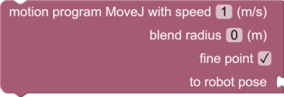
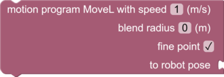

# Robotics Motion Program Blocks and Sandbox Functions

"Motion Program" section in the Blockly toolbox. Provides blocks and functions to build and execute robot motion 
programs. These functions and blocks are provided by the `pyri-robotics-motion-program` package.

# robot_mp_begin

    robot_mp_begin()

Begins a motion program. All following commands will be appended to the current motion program. The program can
be executed using `robot_mp_execute()`

# robot_mp_move_absj

    robot_mp_move_absj(joint_position, speed, blend_radius, fine_point=True)

Move a robot to a joint position in degrees.

Parameters:

* joint_position (array): Desired joint position in degrees
* speed (float): The desired speed in meters/s
* blend_radius (float): The motion program blend radius in meters
* fine_point (bool): If True, robot will stop at the end of command. Otherwise will blend with next command.

# robot_mp_movej

    robot_mp_movej(robot_pose, speed, blend_radius, fine_point=True)

Move a robot to a robot pose in linear joint space.

Parameters:

* robot_pose (RobotPose): Desired robot pose. See `robot_mp_robot_pose()`
* speed (float): The desired velocity in meters/s
* blend_radius (float): The motion program blend radius in meters
* fine_point (bool): If True, robot will stop at the end of command. Otherwise will blend with next command.

# robot_mp_movel

    robot_mp_movel(robot_pose, speed, blend_radius, fine_point=True)

Move a robot to a robot pose in a line in cartesian space.

Parameters:

* robot_pose (RobotPose): Desired robot pose. See `robot_mp_robot_pose()`
* speed (float): The desired velocity in meters/s
* blend_radius (float): The motion program blend radius in meters
* fine_point (bool): If True, robot will stop at the end of command. Otherwise will blend with next command. 

# robot_mp_movec

    robot_mp_movej(robot_pose, speed, blend_radius, fine_point=True)

Move a robot to a robot pose in a circle in cartesian space.

Parameters:

* robot_pose (RobotPose): Desired robot pose. See `robot_mp_robot_pose()`
* speed (float): The desired velocity in meters/s
* blend_radius (float): The motion program blend radius in meters
* fine_point (bool): If True, robot will stop at the end of command. Otherwise will blend with next command.

# robot_mp_robot_pose

    robot_mp_robot_pose(tcp_pose, joint_position_seed)

Create a new `RobotPose`. A `RobotPose` consists of a `Pose` and a joint position seed. The `joint_position_seed` is 
a joint solution that is close to the desired `tcp_pose`. This is used to determine which redundant configuration to
select during inverse kinematics.

Parameters:

* tcp_pose (Pose): The desired pose of the end effector. Use `geometry_pose_new()` to create the pose.
* joint_position_seed (array): The joint position seed in degrees

## robot_mp_execute

     robot_mp_execute(wait)

Execute the motion program assembled using the previous commands. If wait is `True`,
the function will block until the motion program is complete. If it is
`False`, the function will return immediately. Use
`time_wait_for_completion()` or `time_wait_for_completion_all()`
to synchronize completion of the operation.

Parameters:

* wait (bool): True to block until completion, False to return immediately

## robot_mp_set_active_robot

      robot_mp_set_active_robot(robot_name)

Set the active motion program robot. All robot functions will act on this robot.
This has not effect on robots that are executing an asynchronous
operation. The default robot device name is `robot`.

Parameters:

* robot_name (str): The motion program robot local device name

## robot_mp_set_active_tool

      robot_mp_set_active_tool(tool_name)

Set the active motion program tool. The default tool device name is `tool`.

Parameters:

* tool_name (str): The tool local device name

## robot_mp_load

    robot_mp_load(motion_program)

Loads a motion program from a variable. Use `global_value_get()` to retrieve the global variable and pass to this
function. The motion program can then be executed using `robot_mp_execute()`